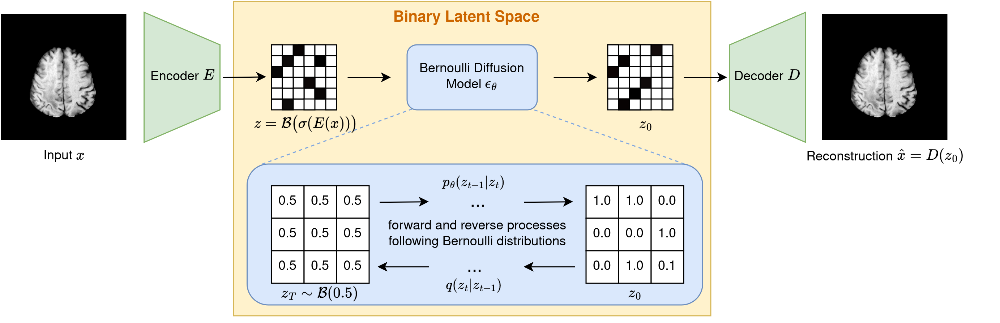

# Binary Noise for Binary Problems: Unsupervised Anomaly Detection with Masked Bernoulli Diffusion Models

This anonymous repo contains the Pytorch implementation of the MICCAI submission 424.

We currently provide:

- Our code base is divided into two pars: The folder *binary_autoencoder* contains code for the training of the binarizing encoder-decoder model. The folder *bernoulli-diffusion*   contains code for the training and evaluation of the Bernoulli diffusion model in the binary latent space. 

- A mini-example how the data needs to be stored can be found in the folder *data* 

### Training of the Binarizing Autoencoder
- To run the training of the binarizing autoencoder on the BRATS2020 dataset, run
 `python -m torch.distributed.launch --nproc_per_node=1 --use_env train_ae_dist.py --dataset brats --amp --ema --steps_per_save_output 5000 --codebook_size 128  --nf 32 --steps_per_log 200 --steps_per_checkpoint 10000 --img_size 256 --batch_size 24 --latent_shape 1 32 32 --ch_mult 1 2 2 4 --n_channels=4  --log_dir logs/binaryae_brats_custom32_128ch --norm_first --data_dir ./data/brats/train_healthy`
- To run the training of the binarizing autoencoder on the OCT dataset, run
 `python -m torch.distributed.launch --nproc_per_node=1 --use_env  train_ae_dist.py --dataset OCT --amp --ema --steps_per_save_output 5000 --codebook_size 128  --nf 32 --steps_per_log 200 --steps_per_checkpoint 10000 --img_size 256 --batch_size 20 --latent_shape 1 32 32 --ch_mult 1 2 2 4 --n_channels=1  --log_dir logs/binaryae_OCT_custom32_128ch  --norm_first --data_dir ./data/OCT/NORMAL`

### Training of the Bernoulli Diffusion Model

- To run the training of the Bernoulli diffusion model on the BRATS2020 dataset, run
`python scripts/latent_train.py --sampler bld  --dataset chexpert --data_dir './data/brats/train_healthy'  --codebook_size 128 --nf 32  --img_size 256 --batch_size 36 --latent_shape 1 32 32 --ch_mult 1 2 2 4 --n_channels=4 --ae_load_dir ../BinaryLatentDiffusion/logs/binaryae_brats_custom32_128ch --ae_load_step 120000`
- To run the training of the Bernoulli diffusion model on the OCT2017 dataset, run
 `python scripts/latent_train.py --sampler bld  --dataset OCT --data_dir './data/OCT/NORMAL'  --codebook_size 128 --nf 32  --img_size 256 --batch_size 36 --latent_shape 1 32 32 --ch_mult 1 2 2 4 --n_channels=1 --ae_load_dir ../BinaryLatentDiffusion/logs/binaryae_OCT_custom32_128ch --ae_load_step 12000 --data_dir ./data/OCT/NORMAL`

### Inference
- To run the inference on the BRATS2020 test set, run
   `python scripts/latent_sample_anomaly.py    --sampler bld  --dataset chexpert --data_dir './data/brats/val_diseased'  --codebook_size 128 --nf 32  --img_size 256 --batch_size 1 --latent_shape 1 32 32 --ch_mult 1 2 2 4 --n_channels=4  --ae_load_dir ../BinaryLatentDiffusion/logs/binaryae_brats_custom32_128ch --ae_load_step 12000 --amp --ema  --norm_first `
- To run the evaluation script to get the anomaly detection scores, run
   `python3 scripts/evaluation.py`

- To run the inference on the OCT test set, run
    `python scripts/latent_sample_anomaly.py    --sampler bld  --dataset chexpert --data_dir './data/OCT/DRUSEN'  --codebook_size 128 --nf 32  --img_size 256 --batch_size 1 --latent_shape 1 32 32 --ch_mult 1 2 2 4 --n_channels=1  --ae_load_dir ../BinaryLatentDiffusion/logs/binaryae_OCT_custom32_128ch --ae_load_step 12000 --amp --ema  --norm_first`

## Comparing Methods
### AnoDDPM
We implement the method [AnoDDPM: Anomaly Detection With Denoising Diffusion Probabilistic Models Using Simplex Noise](https://openaccess.thecvf.com/content/CVPR2022W/NTIRE/html/Wyatt_AnoDDPM_Anomaly_Detection_With_Denoising_Diffusion_Probabilistic_Models_Using_Simplex_CVPRW_2022_paper.html) as suggested in [this Github Repo](https://github.com/Julian-Wyatt/AnoDDPM).
We adapt the dataloader to take input images of resolution 4x256x256 (BRATS2020), or 1x256x256 (OCT2017) respectively. We train the model for 2000 epochs on each dataset. As suggested in their paper, during inference, we add 250 steps of simplex noise to the input image and iterate through the denoising process following a simplex noise schedule.

### Latent Diffusion Model (LDM)
We follow the paper [Fast Unsupervised Brain Anomaly Detection and Segmentation with Diffusion Models](https://conferences.miccai.org/2022/papers/211-Paper1680.html).
For the pytorch code, we follow the tutorial for the 2d latent diffusion model given in [MONAIGenerative](https://github.com/Project-MONAI/GenerativeModels/tree/main/tutorials/generative/2d_ldm).
For the autoencoder, we use the implementation of the [VQVAE](https://github.com/Project-MONAI/GenerativeModels/blob/main/generative/networks/nets/vqvae.py). We train it for 100 epochs with a batch size of 24.
For the diffusion model in the latent space, we follow the implementation of the [2D latent diffusion model](https://github.com/Project-MONAI/GenerativeModels/blob/main/generative/networks/nets/diffusion_model_unet.py). We train it for 200 epochs with a batch size of 24.
During sampling, we achieved the best healthy reconstructions by adding L=300 steps of noise to the input images, and then iteratively going through the Gaussian denoising process. The masking is applied as described in

### pDDPM
We follow the paper [Patched Diffusion Models for Unsupervised Anomaly Detection in Brain MRI](https://arxiv.org/abs/2303.03758) and obtain healthy reconstructions via a patch-based inpainting task.
We adapt the Github repo proposed [here](https://github.com/FinnBehrendt/patched-Diffusion-Models-UAD) to work on 2D images of resolution of 4x256x256 (BRATS2020), or 1x256x256 (OCT2017) respectively, and mask out patches of resolution 128x128. For this resolution and patch size, during sampling, we achieved the best healthy reconstructions by adding L=300 steps of noise to the input images.

### AutoDDPM
According to [Mask, Stitch, and Re-Sample: Enhancing Robustness and Generalizability in Anomaly Detection through Automatic Diffusion Models](https://openreview.net/pdf/bccb1a6f870d1e91bbe01e1f472e196154d8e5ac.pdf), we implement AutoDDPM following [this Github repo](https://github.com/ci-ber/autoDDPM). We train for 630 epochs on the BRATS2020 dataset. On the OCT2017 datasets, 66 epochs were sufficient. The batch size is chosen to be 4 on both datasets.

